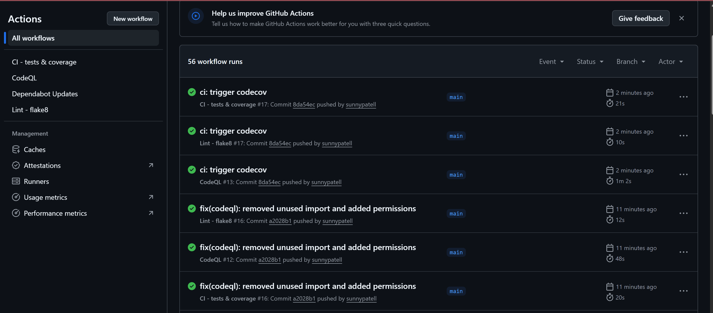
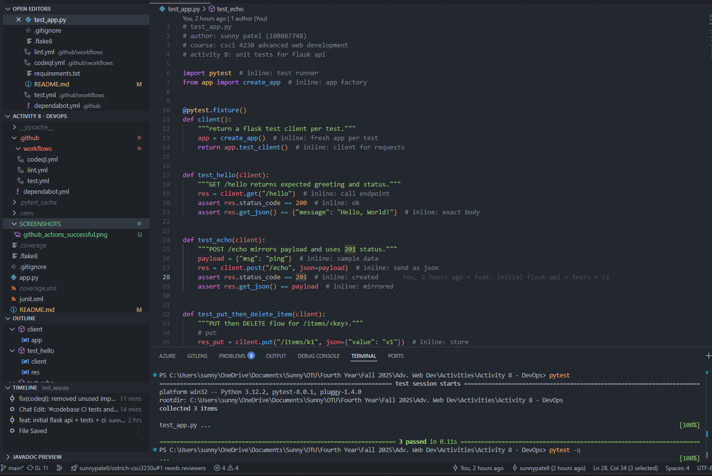

# Activity 8 – DevOps: Advanced GitHub Actions for a Flask App
Sunny Patel (100867748) • CSCI 4230 Advanced Web Development

This project implements a minimal Flask API and a full DevOps automation stack (tests, coverage, linting, security scanning, dependency updates) per the activity instructions.

## ✅ Requirements Satisfaction Checklist
| Requirement | Implemented | Evidence |
|-------------|-------------|----------|
| Minimal Flask service | Yes | `app.py` provides `/hello`, `/echo`, `/items/<key>` (PUT/DELETE) |
| Unit tests with pytest | Yes | `test_app.py` (3 test functions) all passing locally & in CI |
| Run tests locally | Yes | `pytest -q` succeeds (3 passed) |
| GitHub Actions CI (tests + coverage) | Yes | `.github/workflows/test.yml` matrix (3.10, 3.11, 3.12) + `pytest --cov` + `coverage.xml` |
| Linting (Flake8) | Yes | `.github/workflows/lint.yml` + `.flake8` config; latest run passes after removing unused import |
| Coverage reporting (Codecov) | Yes | Codecov action (`codecov/codecov-action@v4`) uploads coverage; public repo so token not required |
| Dependabot for pip updates | Yes | `.github/dependabot.yml` weekly schedule |
| CodeQL security analysis | Yes | `.github/workflows/codeql.yml` with permissions (actions/content read, security-events write) |
| Matrix builds (multiple Python versions) | Yes | `strategy.matrix.python-version: ["3.10", "3.11", "3.12"]` in test workflow |
| Extended endpoints (POST/PUT/DELETE) | Yes | `/echo` (POST), `/items/<key>` PUT & DELETE implemented & tested |
| README documents endpoints & issues | Yes | Sections below + note on resolved lint issue |
| Optional deployment | Not implemented (documented guidance optional) | Out of scope for mandatory portion |

All mandatory criteria are satisfied. The only issue encountered was a Flake8 F401 (unused import) which was fixed. CodeQL initially failed due to code scanning not enabled; enabling it resolved the workflow.

## What’s Included
- Flask API (`app.py`)
- Tests (`test_app.py`) with coverage
- GitHub Actions Workflows:
  - Tests & Coverage (matrix)
  - Lint (Flake8)
  - CodeQL security scan
  - Codecov upload (in test workflow)
- Dependabot config
- Flake8 config, requirements, .gitignore

## Project Structure
```
app.py
test_app.py
requirements.txt
.flake8
.gitignore
.github/
  workflows/
    test.yml
    lint.yml
    codeql.yml
  dependabot.yml
README.md
```

## Run Locally (Windows PowerShell)
```powershell
python -m venv .venv
. .\.venv\Scripts\Activate.ps1
pip install -r requirements.txt
python .\app.py
```

Open http://127.0.0.1:5000/hello

## Run Tests & Coverage Locally
```powershell
pytest -q
pytest -q --cov=app --cov-report=term --cov-report=xml
```
Generates `coverage.xml` consumed by Codecov.

## Initial Git Setup & Push
```bash
git init
git add .
git commit -m "activity 8 initial"
git branch -M main
git remote add origin https://github.com/sunnypatell/csci4230-advwebdev-devops-activity.git
git push -u origin main
```

## Codecov Setup
- Public repo: no token needed (this repo is public but I've created a repo secret anyways to demo).
- Private repo (general guidance): create token in Codecov and store as secret `CODECOV_TOKEN`.
- Workflow: uploads `coverage.xml` after tests.

## Files
- `app.py` — Flask app
- `test_app.py` — pytest tests
- `.github/workflows/test.yml` — matrix + coverage + Codecov
- `.github/workflows/lint.yml` — flake8
- `.github/workflows/codeql.yml` — CodeQL security
- `.github/dependabot.yml` — weekly pip updates
- `.flake8`, `requirements.txt`, `.gitignore`

## API Endpoints & Contracts
- `GET /hello` → `{"message":"Hello, World!"}`
- `POST /echo` → mirrors request JSON with 201
- `PUT /items/<key>` body: `{"value": "..."}`
- `DELETE /items/<key>` → `{"deleted": "<key>"}`

### Data Contracts
- PUT request: `{ "value": <string|number> }` → Response: `{ "key": <key>, "value": <string> }`
- DELETE success: `{ "deleted": <key> }` (404 if missing)
- Error responses use Flask abort with appropriate HTTP status.

## Submission Checklist
1. ZIP of the repository
2. Screenshots (latest passing runs):
  - CI matrix (tests & coverage) – show all Python versions green
  - Lint workflow success
  - CodeQL analysis success
3. Short implementation notes (example below):
  > Implemented Flask API with greeting, echo, and key-value store endpoints. Added pytest tests (3). Initial lint failure (unused import) resolved. Enabled Code scanning for CodeQL. Coverage uploaded to Codecov.

## Proof (Screenshots)

### GitHub Actions — all jobs passed (tests, lint, CodeQL)


### Local pytest — all tests passing


## Troubleshooting
- Pytest missing: ensure `pytest`, `pytest-cov`, `flask` in `requirements.txt`.
- Codecov upload fail (public): verify `coverage.xml` path; remove token line if not needed.
- Flake8 errors: run `flake8 app.py test_app.py`; tweak `.flake8` or fix code.
- CodeQL failing with permissions: ensure workflow includes `permissions` and repository Code scanning is enabled.
- Matrix build failure: narrow Python versions or adjust syntax if a version-specific feature breaks.

## CI/CD Workflows Summary
| Workflow | Purpose | Key Steps |
|----------|---------|-----------|
| test.yml | Tests + coverage + Codecov | setup-python, install deps, pytest with coverage, upload coverage |
| lint.yml | Flake8 style checks | setup-python, install flake8, run flake8 |
| codeql.yml | Static security scan | checkout, CodeQL init, analyze |
| dependabot.yml | Dependency update PRs | weekly pip ecosystem scan |

## Notes
Resolved issues: unused import (`json`) in `test_app.py` (Flake8 F401). CodeQL required enabling Code scanning in repository settings or make the repo public instead of private.

